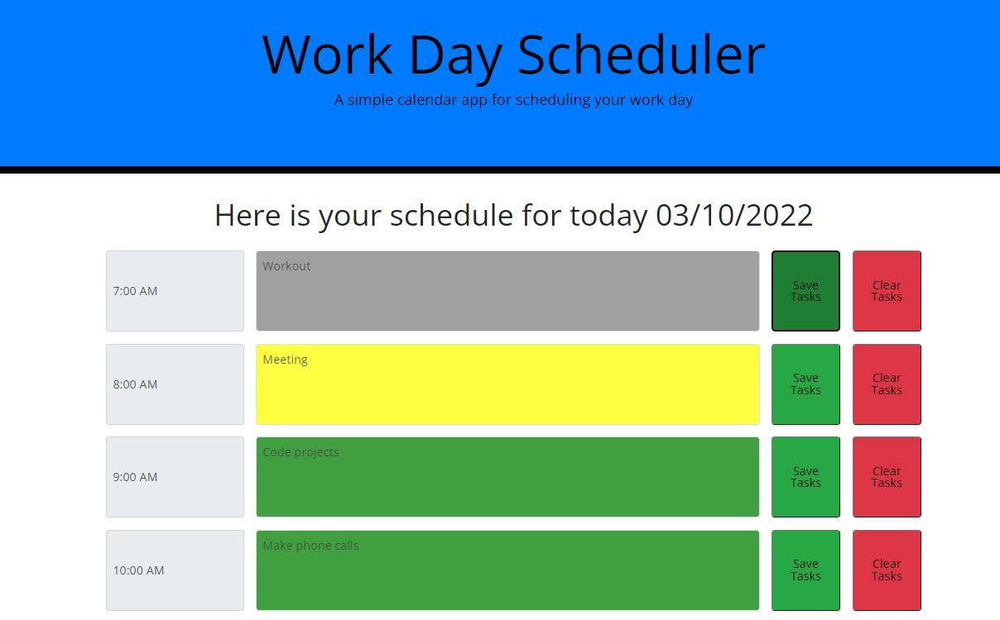

# Work Day Scheduler Starter Code

## Project Description
Generate random passwords based on certain criteria such as character type and password length

## Acceptance Criteria
GIVEN I need a new, secure password
1. WHEN I open the planner
THEN the current day is displayed at the top of the calendar
2. WHEN I scroll down
THEN I am presented with time blocks for standard business hours
3. WHEN I view the time blocks for that day
THEN each time block is color-coded to indicate whether it is in the past, present, or future
4. WHEN I click into a time block
THEN I can enter an event
5. WHEN I click the save button for that time block
THEN the text for that event is saved in local storage
6. WHEN I refresh the page
THEN the saved events persist

## Screenshots and Links
Link: [Workday Calendar](https://colinc27.github.io/WorkdayScheduler/)

## Made by Colin Christoph